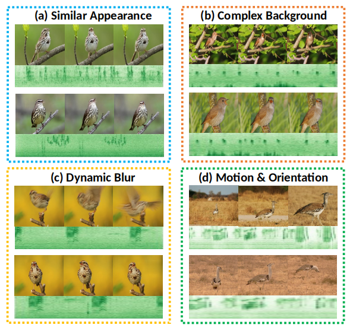

# MAVT-FG: Multimodal Audio-Visual Transformer for Weakly-supervised Fine-Grained Recognition

This repository is the **anonymous** Pytorch implementation of the MAVT-FG method.

## Main Idea

1. In this work, we are the first to introduce audio-visual multimodal to fine-grained recognition at video-level.
2. We introduce a novel framework MAVT-FG which enables the capture of discriminative regions in real-world videos. MAVT-FG contains a Dual-Encoder for feature extraction, DAVF for audio-visual fusion and SSFG for searching and selecting fine-grained parts. The proposed audio-visual deep neural network can obtain a large improvement over the traditional unimodal system and other multimodal fine-grained methods. 

3. A new benchmark dataset FGB-AV for weakly-supervised fine-grained recognition at video-level is proposed, which includes 7k pairs of high-quality video clips and corresponding audio tracks for 30 subcategories of birds.

## Fine-grained Birds of Audio-Visual (FGB-AV)

## The State-of-the-art Performance

## Visualization

## Installation and Requirements

### Installation

> * python 3.7
>
> * pyTorch 1.4.0
>
> * tqdm

### Data Preparation

> * Our benchmark FGB-AV is provided in this repo
> * Download the raw data from [PKU-XMedia](http://59.108.48.34/tiki/FGCrossNet)

### Training & Testing

> * Training

> * Testing
